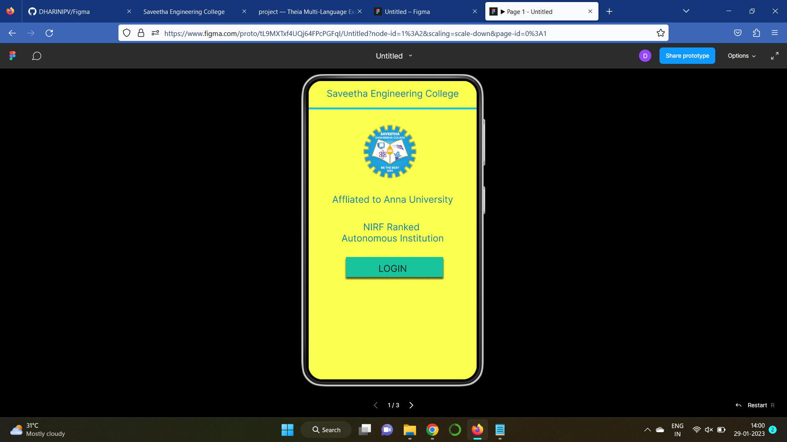
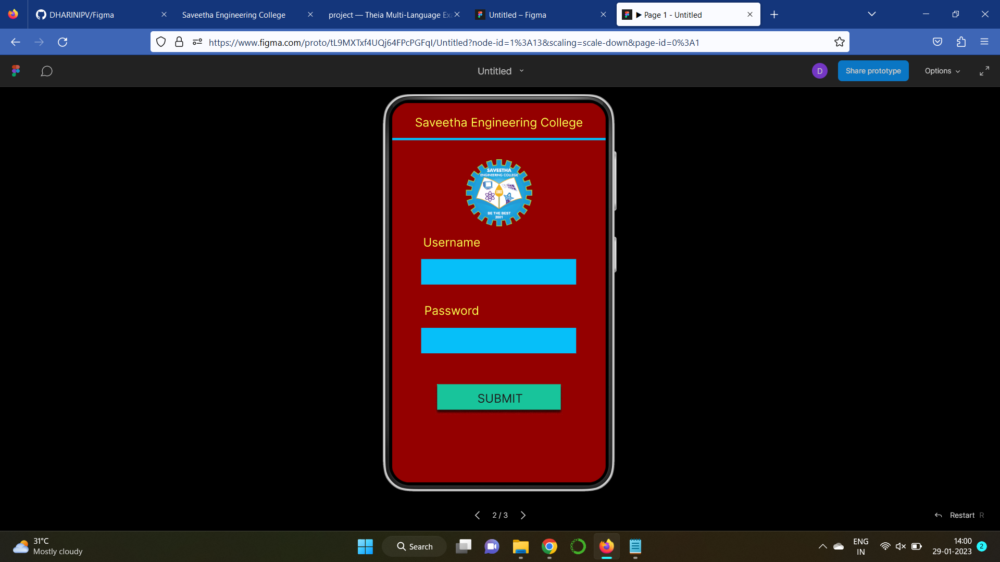
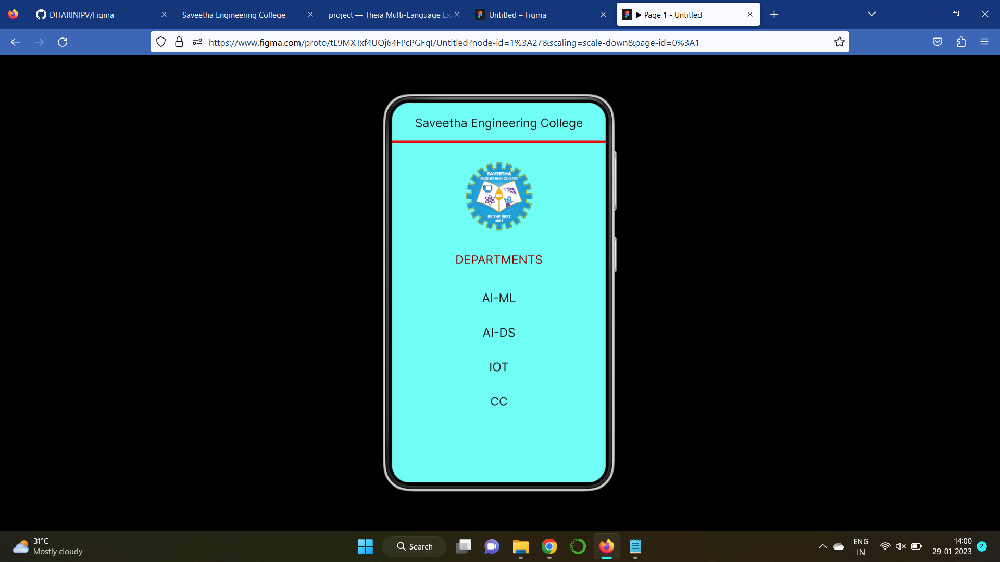

# Event Registration Web Application

## AIM:
To design, develop and deploy a web application for event registration.

## DESIGN STEPS:

### Step 1:
Create a new frame.

### Step 2:
Select any one preset size of your choice.

### Step 3:
Select the shapes you need.

### Step 4:
Import images as needed.

### Step 5:
Create pages based on your need and link them.

### Step 6:
Validate the HTML and CSS code.

### Step 6:
Publish the website in the given URL.

## DESIGN TOOL:
Figma

## Code:
```
/* Home Page */
position: relative;
width: 360px;
height: 640px;
background: #FBFF4F;

/* Login Page */
position: relative;
width: 360px;
height: 640px;
background: #940000;

/* Saveetha Engineering College */
position: absolute;
width: 330px;
height: 30px;
left: 15px;
top: 22px;
font-family: 'Inter';
font-style: normal;
font-weight: 400;
font-size: 20px;
line-height: 24px;
text-align: center;
color: #1E1E1E;

/* DEPARTMENTS */
position: absolute;
width: 330px;
height: 30px;
left: 15px;
top: 252px;
font-family: 'Inter';
font-style: normal;
font-weight: 400;
font-size: 20px;
line-height: 24px;
text-align: center;
color: #940000;

/* AI-ML */
position: absolute;
width: 330px;
height: 30px;
left: 15px;
top: 317px;
font-family: 'Inter';
font-style: normal;
font-weight: 400;
font-size: 20px;
line-height: 24px;
text-align: center;
color: #1E1E1E;

/* AI-DS */
position: absolute;
width: 330px;
height: 30px;
left: 15px;
top: 375px;
font-family: 'Inter';
font-style: normal;
font-weight: 400;
font-size: 20px;
line-height: 24px;
text-align: center;
color: #1E1E1E;

/* IOT */
position: absolute;
width: 330px;
height: 30px;
left: 15px;
top: 433px;
font-family: 'Inter';
font-style: normal;
font-weight: 400;
font-size: 20px;
line-height: 24px;
text-align: center;
color: #1E1E1E;

/* CC */
position: absolute;
width: 330px;
height: 30px;
left: 15px;
top: 491px;
font-family: 'Inter';
font-style: normal;
font-weight: 400;
font-size: 20px;
line-height: 24px;
text-align: center;
color: #1E1E1E;

/* Line 3 */
position: absolute;
width: 360px;
height: 0px;
left: 0px;
top: 67px;
border: 4px solid #EC0A0A;

/* Logo 3 */
position: absolute;
width: 114px;
height: 128px;
left: 123px;
top: 89px;
background: url(Logo.png);
```

## OUTPUT:





## RESULT:
The program to design, develop and deploy a web application for event registration is completed successfully.